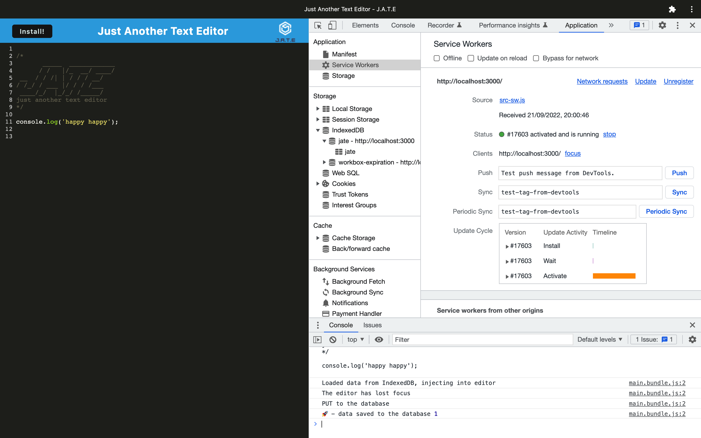

# pwa-text-editor

## Table of Contents

* [Description](#description)
* [Access](#access)
* [Installation](#installation)
* [Usage](#usage)
* [Credits](#credits)

## Description

My goal for this project was to build a text editor that meets PWA criteria. This single page application can run in the browser and offline.

### User Story

```
AS A developer
I WANT to create notes or code snippets with or without an internet connection
SO THAT I can reliably retrieve them for later use.
```

### Tools and Technologies Used

To create this application, I used:
- IndexedDB (via the idb package) as a database
- Webpack to bundle front-end code
- Workbox to create a service worker that caches static assets
- And, Heroku.

### Screenshot of Application



## Access

### Code Repository

The repository where the code is saved is on Github. To access it, click [here](https://github.com/hayleyarodgers/pwa-text-editor).

### Live Application

My application is deployed on Heroku. To access it, click [here](https://hayleyarodgers-pwa-text-editor.herokuapp.com/).

## Installation

To install necessary dependencies, run the following command:

```
npm i
```

## Usage

To use the application from the command line (after installing dependencies):
1. Open the root directory of the repository in your terminal or bash.
2. Bundle the front-end code by entering ```npm run build``` in the command line.
3. Start the server by entering ```npm run start``` in the command line.
4. Go to the port on your local host.
5. Click the "Install" button.

Alternatively, to use the live application, click [here](https://hayleyarodgers-pwa-text-editor.herokuapp.com/).

## Credits

- This is the [starter code](https://github.com/coding-boot-camp/cautious-meme) I used.
